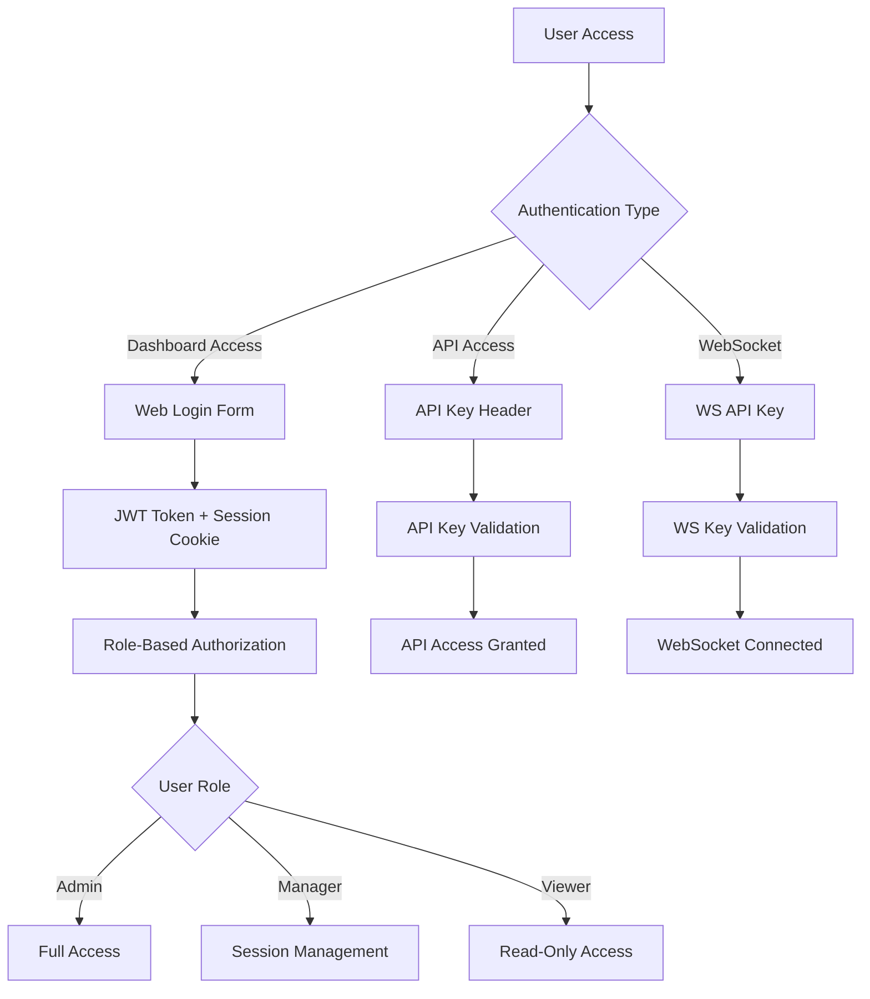

# 🔐 WAHA Security Enhancement Plan - Login System Implementation

## 📋 **EXECUTIVE SUMMARY**

This plan outlines the implementation of a comprehensive authentication and authorization system for WAHA, adding user management, login/logout functionality, and role-based access control while maintaining backward compatibility with existing API key authentication.

## 🎯 **OBJECTIVES**

### **Primary Goals**
- ✅ **Add User Management System** - Database-backed user accounts with roles
- ✅ **Implement Login/Logout Flow** - Web-based authentication for dashboard
- ✅ **Role-Based Access Control** - Different permission levels for users
- ✅ **Maintain API Key Support** - Backward compatibility for programmatic access
- ✅ **Enhance Security** - Modern authentication practices and security headers

### **Secondary Goals**
- ✅ **Multi-Factor Authentication** - Optional 2FA support
- ✅ **Audit Logging** - Track user actions and security events
- ✅ **Rate Limiting** - Prevent brute force attacks
- ✅ **Session Management** - Secure session handling with JWT

## 🏗️ **CURRENT STATE ANALYSIS**

### **Existing Security Infrastructure**
```typescript
// Current Authentication Methods
1. API Key Authentication (X-Api-Key header)
   - Plain text or SHA512 hashed keys
   - Passport HeaderAPIKeyStrategy
   - Applied via AuthMiddleware

2. Basic Auth for Dashboard
   - Username/password via environment variables
   - WAHA_DASHBOARD_USERNAME/PASSWORD
   - Applied to /dashboard routes

3. WebSocket Authentication
   - API key validation for WS connections
   - Query parameter: x-api-key

4. Swagger Authentication
   - Basic auth for Swagger UI
   - WHATSAPP_SWAGGER_USERNAME/PASSWORD
```

### **Current Limitations**
- ❌ **No User Management** - Single dashboard user only
- ❌ **No Role-Based Access** - All users have same permissions
- ❌ **Basic Auth Only** - No modern authentication flow
- ❌ **No Session Management** - No logout, session expiry
- ❌ **Limited Security** - No 2FA, audit logging, rate limiting

## 🎨 **SECURITY ARCHITECTURE DESIGN**

### **Authentication Flow Overview**


### **Multi-Layer Security Model**
```typescript
// Security Layers
1. Network Layer
   - HTTPS enforcement
   - Security headers (Helmet.js)
   - CORS configuration

2. Authentication Layer
   - JWT tokens for web sessions
   - API keys for programmatic access
   - Optional 2FA (TOTP)

3. Authorization Layer
   - Role-based permissions
   - Resource-level access control
   - Session-specific permissions

4. Application Layer
   - Rate limiting
   - Input validation
   - CSRF protection

5. Audit Layer
   - Login/logout tracking
   - Action logging
   - Security event monitoring
```

## 📊 **DATABASE SCHEMA DESIGN**

### **User Management Tables**
```sql
-- Users table
CREATE TABLE users (
    id UUID PRIMARY KEY DEFAULT gen_random_uuid(),
    username VARCHAR(50) UNIQUE NOT NULL,
    email VARCHAR(255) UNIQUE NOT NULL,
    password_hash VARCHAR(255) NOT NULL,
    salt VARCHAR(255) NOT NULL,
    role VARCHAR(20) NOT NULL DEFAULT 'viewer',
    is_active BOOLEAN DEFAULT true,
    is_email_verified BOOLEAN DEFAULT false,
    two_factor_enabled BOOLEAN DEFAULT false,
    two_factor_secret VARCHAR(255),
    last_login_at TIMESTAMP,
    failed_login_attempts INTEGER DEFAULT 0,
    locked_until TIMESTAMP,
    created_at TIMESTAMP DEFAULT CURRENT_TIMESTAMP,
    updated_at TIMESTAMP DEFAULT CURRENT_TIMESTAMP
);

-- User sessions table
CREATE TABLE user_sessions (
    id UUID PRIMARY KEY DEFAULT gen_random_uuid(),
    user_id UUID REFERENCES users(id) ON DELETE CASCADE,
    session_token VARCHAR(255) UNIQUE NOT NULL,
    refresh_token VARCHAR(255) UNIQUE NOT NULL,
    ip_address INET,
    user_agent TEXT,
    expires_at TIMESTAMP NOT NULL,
    created_at TIMESTAMP DEFAULT CURRENT_TIMESTAMP,
    last_accessed_at TIMESTAMP DEFAULT CURRENT_TIMESTAMP
);

-- API keys table (enhanced)
CREATE TABLE api_keys (
    id UUID PRIMARY KEY DEFAULT gen_random_uuid(),
    user_id UUID REFERENCES users(id) ON DELETE CASCADE,
    name VARCHAR(100) NOT NULL,
    key_hash VARCHAR(255) NOT NULL,
    permissions JSONB DEFAULT '{}',
    is_active BOOLEAN DEFAULT true,
    last_used_at TIMESTAMP,
    expires_at TIMESTAMP,
    created_at TIMESTAMP DEFAULT CURRENT_TIMESTAMP
);

-- Audit log table
CREATE TABLE audit_logs (
    id UUID PRIMARY KEY DEFAULT gen_random_uuid(),
    user_id UUID REFERENCES users(id) ON DELETE SET NULL,
    action VARCHAR(100) NOT NULL,
    resource_type VARCHAR(50),
    resource_id VARCHAR(255),
    details JSONB,
    ip_address INET,
    user_agent TEXT,
    created_at TIMESTAMP DEFAULT CURRENT_TIMESTAMP
);

-- User roles and permissions
CREATE TABLE roles (
    id UUID PRIMARY KEY DEFAULT gen_random_uuid(),
    name VARCHAR(50) UNIQUE NOT NULL,
    description TEXT,
    permissions JSONB NOT NULL DEFAULT '{}',
    created_at TIMESTAMP DEFAULT CURRENT_TIMESTAMP
);
```

### **Role-Based Permissions**
```typescript
// Permission System
interface UserRole {
  name: 'admin' | 'manager' | 'viewer' | 'api_only';
  permissions: {
    sessions: {
      create: boolean;
      read: boolean;
      update: boolean;
      delete: boolean;
      start: boolean;
      stop: boolean;
    };
    users: {
      create: boolean;
      read: boolean;
      update: boolean;
      delete: boolean;
      manage_roles: boolean;
    };
    system: {
      view_logs: boolean;
      manage_settings: boolean;
      view_health: boolean;
    };
    api_keys: {
      create: boolean;
      read: boolean;
      revoke: boolean;
    };
  };
}

// Default Roles
const DEFAULT_ROLES = {
  admin: {
    name: 'admin',
    permissions: { /* all permissions true */ }
  },
  manager: {
    name: 'manager', 
    permissions: {
      sessions: { all: true },
      users: { read: true },
      system: { view_logs: true, view_health: true },
      api_keys: { create: true, read: true }
    }
  },
  viewer: {
    name: 'viewer',
    permissions: {
      sessions: { read: true },
      system: { view_health: true }
    }
  },
  api_only: {
    name: 'api_only',
    permissions: {} // API access only, no dashboard
  }
};
```

## 🚀 **IMPLEMENTATION PHASES**

### **Phase 1: Core Authentication Infrastructure** (Week 1-2)
```typescript
// 1.1 User Management Service
@Injectable()
export class UserService {
  async createUser(userData: CreateUserDto): Promise<User>
  async validateUser(username: string, password: string): Promise<User | null>
  async updateUser(id: string, updates: UpdateUserDto): Promise<User>
  async deleteUser(id: string): Promise<void>
  async getUserByEmail(email: string): Promise<User | null>
  async lockUser(id: string, duration: number): Promise<void>
}

// 1.2 Authentication Service
@Injectable()
export class AuthService {
  async login(credentials: LoginDto): Promise<AuthResult>
  async logout(sessionToken: string): Promise<void>
  async refreshToken(refreshToken: string): Promise<AuthResult>
  async validateSession(sessionToken: string): Promise<User | null>
  async enable2FA(userId: string): Promise<string> // Returns QR code
  async verify2FA(userId: string, token: string): Promise<boolean>
}

// 1.3 JWT Strategy
@Injectable()
export class JwtStrategy extends PassportStrategy(Strategy) {
  constructor(private authService: AuthService) {
    super({
      jwtFromRequest: ExtractJwt.fromExtractors([
        ExtractJwt.fromAuthHeaderAsBearerToken(),
        ExtractJwt.fromCookies('session_token'),
      ]),
      secretOrKey: process.env.JWT_SECRET,
    });
  }
}
```

### **Phase 2: Database Integration** (Week 2-3)
```typescript
// 2.1 User Repository
@Injectable()
export class UserRepository {
  constructor(@Inject('DataStore') private store: DataStore) {}

  async create(user: CreateUserDto): Promise<User>
  async findById(id: string): Promise<User | null>
  async findByUsername(username: string): Promise<User | null>
  async findByEmail(email: string): Promise<User | null>
  async update(id: string, updates: Partial<User>): Promise<User>
  async delete(id: string): Promise<void>
  async incrementFailedAttempts(id: string): Promise<void>
  async resetFailedAttempts(id: string): Promise<void>
}

// 2.2 Session Repository
@Injectable()
export class SessionRepository {
  async createSession(session: CreateSessionDto): Promise<UserSession>
  async findByToken(token: string): Promise<UserSession | null>
  async updateLastAccessed(id: string): Promise<void>
  async deleteSession(id: string): Promise<void>
  async deleteUserSessions(userId: string): Promise<void>
  async cleanupExpiredSessions(): Promise<void>
}

// 2.3 Database Migration
export class CreateAuthTables implements Migration {
  async up(queryRunner: QueryRunner): Promise<void> {
    // Create users, user_sessions, api_keys, audit_logs tables
  }

  async down(queryRunner: QueryRunner): Promise<void> {
    // Drop auth tables
  }
}
```

### **Phase 3: API Endpoints** (Week 3-4)
```typescript
// 3.1 Authentication Controller
@Controller('api/auth')
export class AuthController {
  @Post('login')
  async login(@Body() credentials: LoginDto): Promise<AuthResponse>

  @Post('logout')
  @UseGuards(JwtAuthGuard)
  async logout(@Req() req): Promise<void>

  @Post('refresh')
  async refreshToken(@Body() body: RefreshTokenDto): Promise<AuthResponse>

  @Get('me')
  @UseGuards(JwtAuthGuard)
  async getCurrentUser(@Req() req): Promise<UserDto>

  @Post('change-password')
  @UseGuards(JwtAuthGuard)
  async changePassword(@Body() body: ChangePasswordDto): Promise<void>

  @Post('enable-2fa')
  @UseGuards(JwtAuthGuard)
  async enable2FA(@Req() req): Promise<{ qrCode: string; secret: string }>

  @Post('verify-2fa')
  @UseGuards(JwtAuthGuard)
  async verify2FA(@Body() body: Verify2FADto): Promise<void>
}

// 3.2 User Management Controller
@Controller('api/users')
@UseGuards(JwtAuthGuard, RoleGuard)
export class UsersController {
  @Get()
  @Roles('admin', 'manager')
  async getUsers(@Query() query: GetUsersQuery): Promise<UserDto[]>

  @Post()
  @Roles('admin')
  async createUser(@Body() userData: CreateUserDto): Promise<UserDto>

  @Put(':id')
  @Roles('admin')
  async updateUser(@Param('id') id: string, @Body() updates: UpdateUserDto): Promise<UserDto>

  @Delete(':id')
  @Roles('admin')
  async deleteUser(@Param('id') id: string): Promise<void>

  @Post(':id/reset-password')
  @Roles('admin')
  async resetPassword(@Param('id') id: string): Promise<{ temporaryPassword: string }>
}
```

### **Phase 4: Frontend Components** (Week 4-5)
```typescript
// 4.1 Login Page Component
export const LoginPage: React.FC = () => {
  const [credentials, setCredentials] = useState({ username: '', password: '', twoFactorCode: '' });
  const [showTwoFactor, setShowTwoFactor] = useState(false);
  const [loading, setLoading] = useState(false);

  const handleLogin = async (e: FormEvent) => {
    e.preventDefault();
    setLoading(true);

    try {
      const response = await authService.login(credentials);
      if (response.requiresTwoFactor) {
        setShowTwoFactor(true);
      } else {
        // Redirect to dashboard
        router.push('/dashboard');
      }
    } catch (error) {
      // Handle login error
    } finally {
      setLoading(false);
    }
  };

  return (
    <div className="login-container">
      <form onSubmit={handleLogin}>
        <input type="text" placeholder="Username" required />
        <input type="password" placeholder="Password" required />
        {showTwoFactor && (
          <input type="text" placeholder="2FA Code" required />
        )}
        <button type="submit" disabled={loading}>
          {loading ? 'Logging in...' : 'Login'}
        </button>
      </form>
    </div>
  );
};

// 4.2 User Management Component
export const UserManagement: React.FC = () => {
  const [users, setUsers] = useState<User[]>([]);
  const [showCreateModal, setShowCreateModal] = useState(false);

  const handleCreateUser = async (userData: CreateUserDto) => {
    try {
      await userService.createUser(userData);
      // Refresh users list
      loadUsers();
      setShowCreateModal(false);
    } catch (error) {
      // Handle error
    }
  };

  return (
    <div className="user-management">
      <button onClick={() => setShowCreateModal(true)}>
        Create User
      </button>
      <UserTable users={users} onEdit={handleEditUser} onDelete={handleDeleteUser} />
      {showCreateModal && (
        <CreateUserModal onSubmit={handleCreateUser} onClose={() => setShowCreateModal(false)} />
      )}
    </div>
  );
};
```

### **Phase 5: Security Enhancements** (Week 5-6)
```typescript
// 5.1 Rate Limiting
@Injectable()
export class RateLimitingService {
  private attempts = new Map<string, { count: number; resetTime: number }>();

  checkRateLimit(identifier: string, maxAttempts: number, windowMs: number): boolean {
    const now = Date.now();
    const record = this.attempts.get(identifier);

    if (!record || now > record.resetTime) {
      this.attempts.set(identifier, { count: 1, resetTime: now + windowMs });
      return true;
    }

    if (record.count >= maxAttempts) {
      return false;
    }

    record.count++;
    return true;
  }
}

// 5.2 Audit Logging
@Injectable()
export class AuditService {
  async logAction(action: AuditAction): Promise<void> {
    const auditLog = {
      userId: action.userId,
      action: action.type,
      resourceType: action.resourceType,
      resourceId: action.resourceId,
      details: action.details,
      ipAddress: action.ipAddress,
      userAgent: action.userAgent,
      createdAt: new Date(),
    };

    await this.auditRepository.create(auditLog);
  }

  async getAuditLogs(filters: AuditFilters): Promise<AuditLog[]> {
    return this.auditRepository.findWithFilters(filters);
  }
}

// 5.3 Security Headers Middleware
@Injectable()
export class SecurityHeadersMiddleware implements NestMiddleware {
  use(req: any, res: any, next: () => void) {
    // HTTPS enforcement
    if (process.env.NODE_ENV === 'production' && !req.secure) {
      return res.redirect(301, `https://${req.headers.host}${req.url}`);
    }

    // Security headers
    res.setHeader('X-Content-Type-Options', 'nosniff');
    res.setHeader('X-Frame-Options', 'DENY');
    res.setHeader('X-XSS-Protection', '1; mode=block');
    res.setHeader('Strict-Transport-Security', 'max-age=31536000; includeSubDomains');
    res.setHeader('Referrer-Policy', 'strict-origin-when-cross-origin');
    res.setHeader('Content-Security-Policy', "default-src 'self'; script-src 'self' 'unsafe-inline'; style-src 'self' 'unsafe-inline'");

    next();
  }
}
```

## ⚙️ **CONFIGURATION OPTIONS**

### **Environment Variables**
```bash
# Authentication Configuration
WAHA_AUTH_ENABLED=true
WAHA_JWT_SECRET=your-super-secret-jwt-key
WAHA_JWT_EXPIRES_IN=24h
WAHA_REFRESH_TOKEN_EXPIRES_IN=7d

# Password Policy
WAHA_PASSWORD_MIN_LENGTH=8
WAHA_PASSWORD_REQUIRE_UPPERCASE=true
WAHA_PASSWORD_REQUIRE_LOWERCASE=true
WAHA_PASSWORD_REQUIRE_NUMBERS=true
WAHA_PASSWORD_REQUIRE_SYMBOLS=true

# Rate Limiting
WAHA_LOGIN_RATE_LIMIT_ATTEMPTS=5
WAHA_LOGIN_RATE_LIMIT_WINDOW_MS=900000  # 15 minutes
WAHA_API_RATE_LIMIT_REQUESTS=100
WAHA_API_RATE_LIMIT_WINDOW_MS=60000     # 1 minute

# Security Features
WAHA_2FA_ENABLED=true
WAHA_SESSION_TIMEOUT_MS=86400000        # 24 hours
WAHA_FORCE_HTTPS=true
WAHA_AUDIT_LOGGING_ENABLED=true

# Default Admin User (for initial setup)
WAHA_DEFAULT_ADMIN_USERNAME=admin
WAHA_DEFAULT_ADMIN_PASSWORD=change-me-please
WAHA_DEFAULT_ADMIN_EMAIL=admin@example.com

# Backward Compatibility
WAHA_LEGACY_API_KEY_SUPPORT=true
WAHA_LEGACY_BASIC_AUTH_SUPPORT=false
```

### **Database Configuration**
```typescript
// Database Schema Configuration
interface AuthConfig {
  database: {
    type: 'postgresql' | 'mongodb' | 'sqlite';
    connection: string;
    migrations: {
      enabled: boolean;
      autoRun: boolean;
    };
  };

  security: {
    passwordHashing: {
      algorithm: 'bcrypt';
      rounds: 12;
    };

    jwt: {
      secret: string;
      expiresIn: string;
      refreshExpiresIn: string;
    };

    rateLimit: {
      login: { attempts: number; windowMs: number };
      api: { requests: number; windowMs: number };
    };

    twoFactor: {
      enabled: boolean;
      issuer: string;
      window: number;
    };
  };
}
```

## 🔄 **MIGRATION STRATEGY**

### **Backward Compatibility Plan**
```typescript
// Migration Steps
1. Phase 1: Add new auth system alongside existing
   - Keep current API key authentication working
   - Add new JWT-based authentication
   - Dashboard supports both basic auth and login

2. Phase 2: Gradual migration
   - Create admin user from existing dashboard credentials
   - Migrate API keys to new user-based system
   - Provide migration tools for existing setups

3. Phase 3: Deprecation (optional)
   - Mark legacy basic auth as deprecated
   - Provide migration warnings
   - Eventually remove legacy auth (major version bump)

// Migration Script
export class AuthMigrationService {
  async migrateFromLegacyAuth(): Promise<void> {
    // 1. Create admin user from dashboard credentials
    const dashboardUser = await this.createAdminFromDashboard();

    // 2. Convert existing API keys to user-based keys
    await this.migrateApiKeys();

    // 3. Update configuration
    await this.updateAuthConfig();
  }

  private async createAdminFromDashboard(): Promise<User> {
    const username = process.env.WAHA_DASHBOARD_USERNAME || 'admin';
    const password = process.env.WAHA_DASHBOARD_PASSWORD || 'admin';

    return this.userService.createUser({
      username,
      email: process.env.WAHA_DEFAULT_ADMIN_EMAIL || 'admin@localhost',
      password,
      role: 'admin',
    });
  }
}
```

## 🧪 **TESTING STRATEGY**

### **Security Testing Plan**
```typescript
// Unit Tests
describe('AuthService', () => {
  it('should hash passwords securely', async () => {
    const password = 'testPassword123!';
    const hash = await authService.hashPassword(password);
    expect(hash).not.toBe(password);
    expect(await authService.verifyPassword(password, hash)).toBe(true);
  });

  it('should generate secure JWT tokens', async () => {
    const user = { id: '123', username: 'test', role: 'viewer' };
    const token = await authService.generateToken(user);
    const decoded = await authService.verifyToken(token);
    expect(decoded.id).toBe(user.id);
  });

  it('should enforce rate limiting', async () => {
    const identifier = 'test-user';
    // Test rate limiting logic
  });
});

// Integration Tests
describe('Authentication Flow', () => {
  it('should complete login flow successfully', async () => {
    const response = await request(app)
      .post('/api/auth/login')
      .send({ username: 'testuser', password: 'password123' })
      .expect(200);

    expect(response.body).toHaveProperty('token');
    expect(response.body).toHaveProperty('refreshToken');
  });

  it('should reject invalid credentials', async () => {
    await request(app)
      .post('/api/auth/login')
      .send({ username: 'testuser', password: 'wrongpassword' })
      .expect(401);
  });

  it('should enforce 2FA when enabled', async () => {
    // Test 2FA flow
  });
});

// Security Tests
describe('Security Measures', () => {
  it('should prevent brute force attacks', async () => {
    // Test rate limiting
    for (let i = 0; i < 6; i++) {
      await request(app)
        .post('/api/auth/login')
        .send({ username: 'testuser', password: 'wrong' });
    }

    await request(app)
      .post('/api/auth/login')
      .send({ username: 'testuser', password: 'wrong' })
      .expect(429); // Too Many Requests
  });

  it('should set secure headers', async () => {
    const response = await request(app).get('/dashboard');
    expect(response.headers['x-frame-options']).toBe('DENY');
    expect(response.headers['x-content-type-options']).toBe('nosniff');
  });
});
```

### **Load Testing**
```bash
# Artillery.js load test configuration
config:
  target: 'http://localhost:3000'
  phases:
    - duration: 60
      arrivalRate: 10
      name: "Warm up"
    - duration: 120
      arrivalRate: 50
      name: "Load test"

scenarios:
  - name: "Login flow"
    weight: 70
    flow:
      - post:
          url: "/api/auth/login"
          json:
            username: "testuser"
            password: "password123"
      - get:
          url: "/api/sessions"
          headers:
            Authorization: "Bearer {{ token }}"

  - name: "API key access"
    weight: 30
    flow:
      - get:
          url: "/api/sessions"
          headers:
            X-Api-Key: "{{ apiKey }}"
```

## 📋 **IMPLEMENTATION CHECKLIST**

### **Phase 1: Foundation** ✅
- [ ] **Database Schema**: Create user, session, and audit tables
- [ ] **User Service**: Implement user CRUD operations
- [ ] **Auth Service**: Implement login/logout/token management
- [ ] **Password Security**: Implement bcrypt hashing with salt
- [ ] **JWT Strategy**: Configure Passport JWT strategy

### **Phase 2: Core Features** ✅
- [ ] **Login API**: POST /api/auth/login endpoint
- [ ] **Logout API**: POST /api/auth/logout endpoint
- [ ] **User Management**: CRUD APIs for user management
- [ ] **Role-Based Guards**: Implement authorization guards
- [ ] **Session Management**: Token refresh and validation

### **Phase 3: Security Features** ✅
- [ ] **Rate Limiting**: Implement brute force protection
- [ ] **2FA Support**: TOTP-based two-factor authentication
- [ ] **Audit Logging**: Track all security-relevant actions
- [ ] **Security Headers**: Implement security middleware
- [ ] **CSRF Protection**: Add CSRF tokens for forms

### **Phase 4: Frontend** ✅
- [ ] **Login Page**: React-based login form
- [ ] **User Management UI**: Admin interface for user management
- [ ] **2FA Setup**: QR code generation and verification
- [ ] **Session Management**: Display active sessions
- [ ] **Audit Log Viewer**: Security event monitoring

### **Phase 5: Integration** ✅
- [ ] **Dashboard Integration**: Replace basic auth with login
- [ ] **API Compatibility**: Maintain existing API key support
- [ ] **Migration Tools**: Scripts for upgrading existing installations
- [ ] **Documentation**: Update setup and configuration docs
- [ ] **Testing**: Comprehensive security testing

## 🎯 **SUCCESS METRICS**

### **Security Metrics**
- ✅ **Zero Authentication Bypasses** - No unauthorized access
- ✅ **Rate Limiting Effectiveness** - Block brute force attempts
- ✅ **Session Security** - Secure token management
- ✅ **Audit Coverage** - 100% of security events logged
- ✅ **2FA Adoption** - Optional but encouraged

### **User Experience Metrics**
- ✅ **Login Success Rate** - >99% for valid credentials
- ✅ **Login Performance** - <500ms response time
- ✅ **Dashboard Load Time** - <2s after authentication
- ✅ **API Compatibility** - 100% backward compatibility
- ✅ **Migration Success** - Seamless upgrade path

## 🏆 **CONCLUSION**

This comprehensive security enhancement plan will transform WAHA from a basic auth system to a modern, enterprise-grade authentication and authorization platform while maintaining full backward compatibility.

### **Key Benefits**
- 🔐 **Enhanced Security** - Modern authentication with 2FA, rate limiting, audit logging
- 👥 **User Management** - Multi-user support with role-based access control
- 🔄 **Backward Compatibility** - Existing API keys continue to work
- 📊 **Audit Trail** - Complete security event tracking
- 🚀 **Scalability** - Supports enterprise deployment scenarios

### **Next Steps**
1. **Review and Approve Plan** - Stakeholder approval for implementation
2. **Set Up Development Environment** - Database, testing infrastructure
3. **Begin Phase 1 Implementation** - Core authentication infrastructure
4. **Iterative Development** - Implement phases with testing and feedback
5. **Production Deployment** - Gradual rollout with migration support

**This plan provides a roadmap for implementing enterprise-grade security in WAHA while maintaining the simplicity and reliability that makes it valuable for users.**
